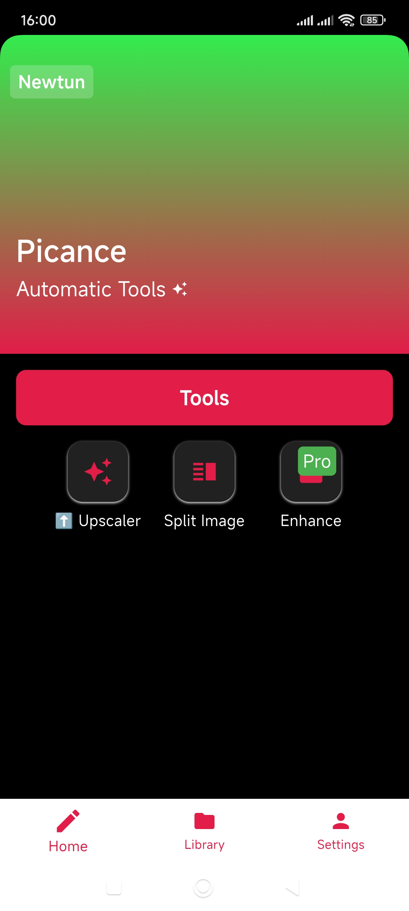
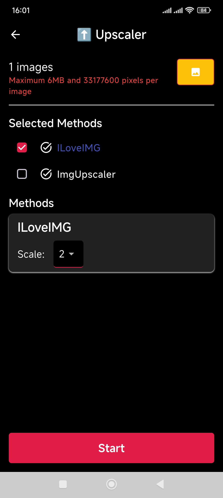
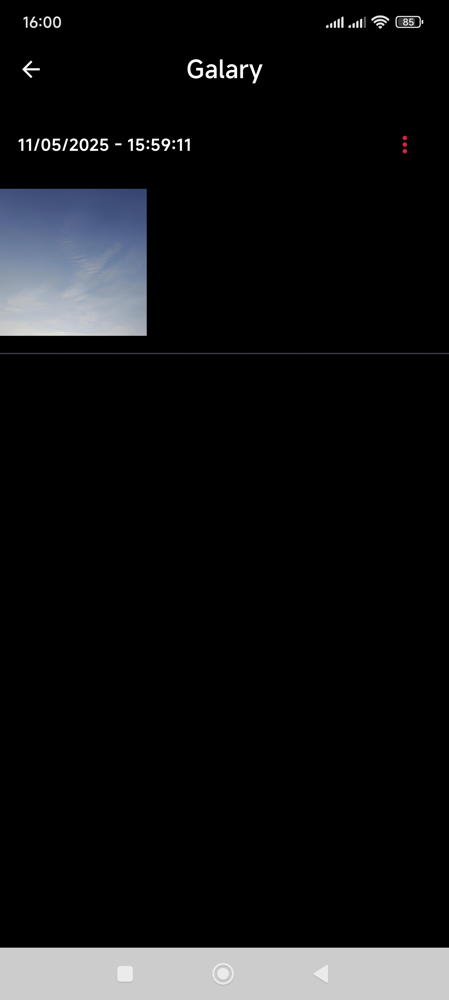
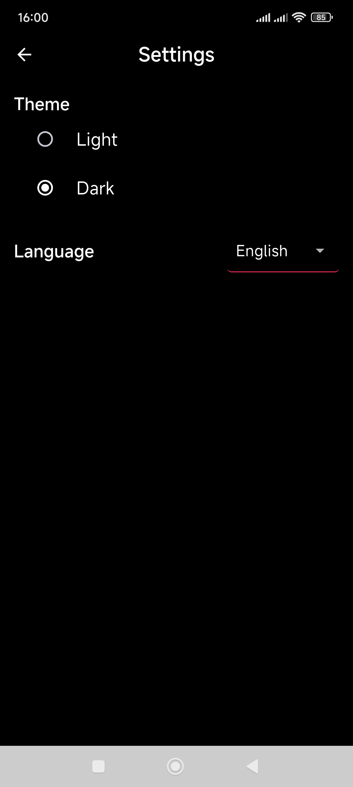

  

  <h3 align="center" style="color: red;">Auto Scaling Image Tool</h3>

<!-- TABLE OF CONTENTS -->

  
Table of Contents

  <ol>
    <li>
      <a href="#about-the-project">About The Project</a>
      <ul>
        <li><a href="#built-with">Built With</a></li>
        <li><a href="#demo">Demo</a></li>
      </ul>
    </li>
    <li>
      <a href="#getting-started-with-source-code">Getting Started With Source Code</a>
      <ul>
        <li><a href="#prerequisites">Prerequisites</a></li>
      </ul>
    </li>
  </ol>

<!-- ABOUT THE PROJECT -->

## About The Project

This project was developed to leverage the API from the website <a src="https://www.iloveimg.com/upscale-image">iloveimg</a> and <a src="https://imgupscaler.com/">Img.Upscaler</a> to automate unlimited image uploads. Iloveimg provides image optimization, and quality improvement services through a powerful API.

With this project, I integrated API to application to automate unlimited image uploads, saving time. The websites initially limited uploads to 3 images at a time.

This tool has shortened the process, specifically just select the images from Gallary, select the scale level and finally wait until all the images are upscaled and downloaded. The result will be saved to app folder, you can review in Gallary of App and move this to Camera or other Folder on device.

(<a href="#readme-top">back to top</a>)

### Built With

- 

(<a href="#readme-top">back to top</a>)

### Demo

    
    
    
    
    
    

## Getting Started With Source Code

### Prerequisites

This is small basic tool. You only need

-   [![Visual Studio Code][VisualStudioCodeBadge]][VisualStudioCodeURL]
-   [![Flutter][DartBadge]][DartURL]
-   [![.NET Core][FlutterBadge]][FlutterCoreURL]

[VisualStudioCodeBadge]: https://img.shields.io/badge/IDE-Visual_Studio_Code-0077FF.svg?logo=visual-studio&style=for-the-badge&logo=nextdotjs&logoColor=white&labelColor=fecaca
[VisualStudioCodeURL]: https://code.visualstudio.com/

[DartBadge]: https://img.shields.io/badge/dart-v.3.27.3-0175C2?style=flat&logo=dart&logoColor=%230175C2&logoSize=20&label=Dart&labelColor=%23ffffff&color=%2302569B
[DartURL]: https://dart.dev/docs

[FlutterBadge]: https://img.shields.io/badge/flutter-v.3.27.3-02569B?style=flat&logo=flutter&logoColor=%2302569B&logoSize=20&label=Flutter&labelColor=%23ffffff&color=%2302569B
[FlutterCoreURL]: https://docs.flutter.dev/